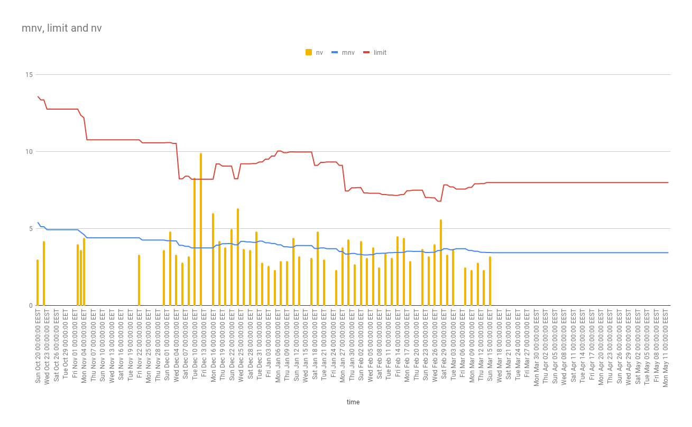
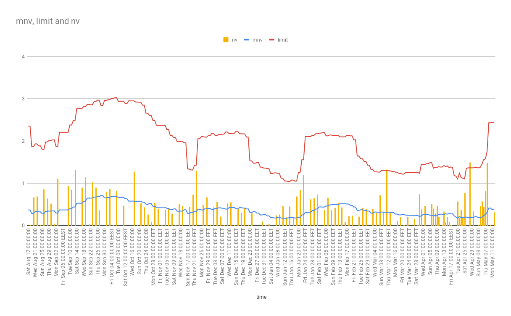
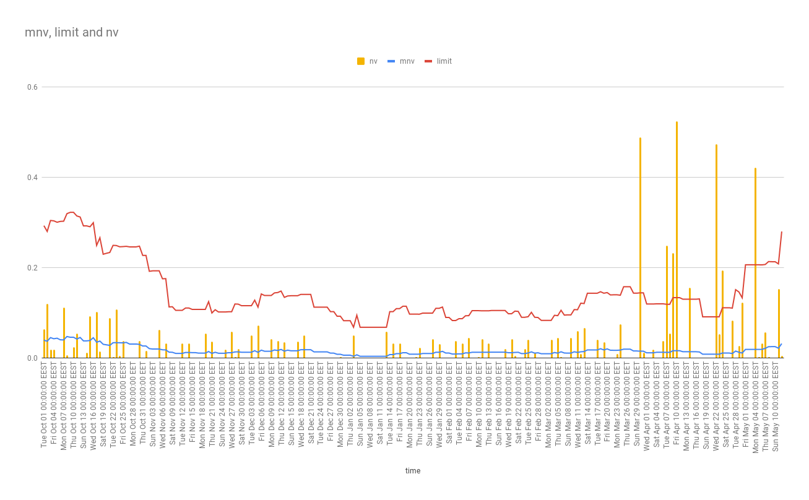
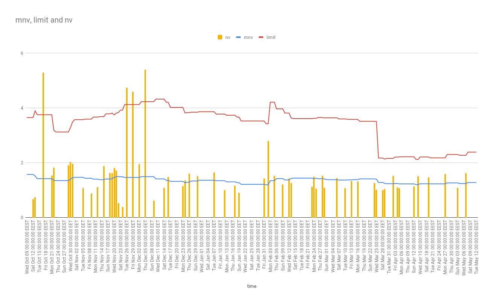
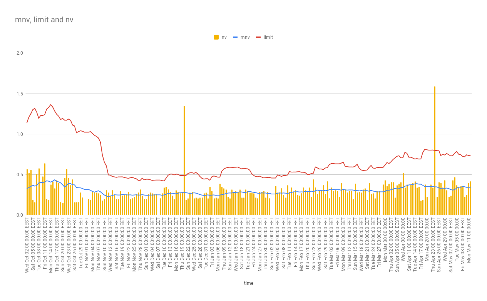

# Minimum Night Volume

Testing water data for detecting leakages and burst pipelines in buildings.
Testing and data analysis is based on this paper: [Leakage Detection Using Smart Water System: Combination of Water Balance and Automated Minimum Night Flow](https://www.researchgate.net/publication/318679206_Leakage_Detection_Using_Smart_Water_System_Combination_of_Water_Balance_and_Automated_Minimum_Night_Flow) 

Methodology:

1. Training data are retrieved from SparkWorks.
1. Water Volume measured during morning hours is calculated (water consumption between 0200-0500) called Minimum Night Volume.
1. A moving average of the last 15 day's Minimum Night Volume is calculated.
1. Iterating on the data in chronological order we compare the MNV with the current day's NV to detect if it exceeds a predefined threshold.
1. If the threshold is exceeded the value is considered an abnormal value, and the day is reported as a possible leakage/pipe burst.

## usage examples

Legend:

+ mnv: moveing average of the Minimum Night Volume
+ limit: the threshold to consider a value as a Leakage
+ nv: the current day's NV
+ full data in [SparksDrive/Projects/LORA Pilot/Night Flows](https://drive.google.com/drive/folders/10G8N6YnSt5mIMiuPQKmNtg7b7iBdqTtk?usp=sharing)

Examples:

+ 0

+ 2

+ 10

+ 12

+ 14

+ 25

