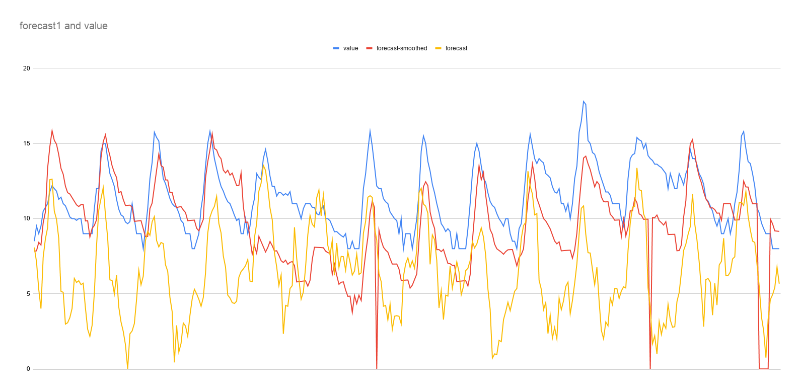
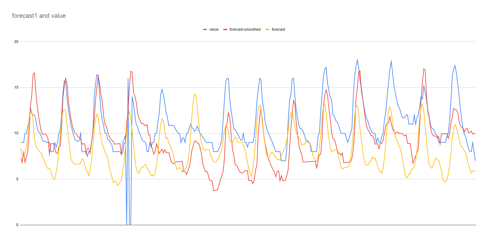
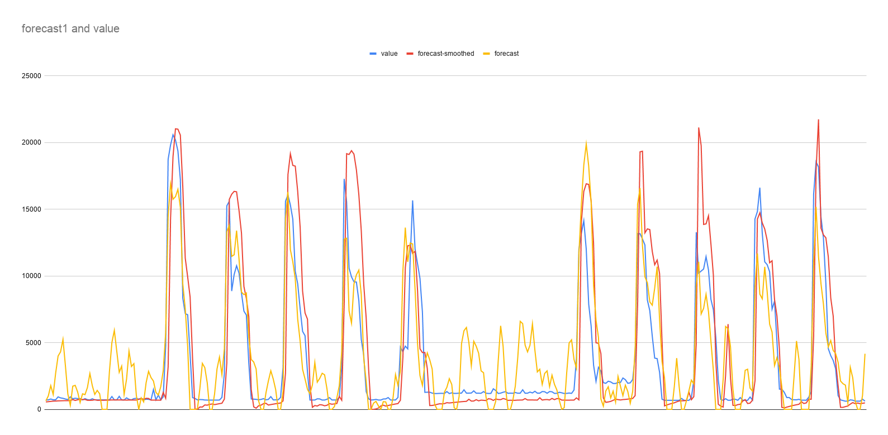
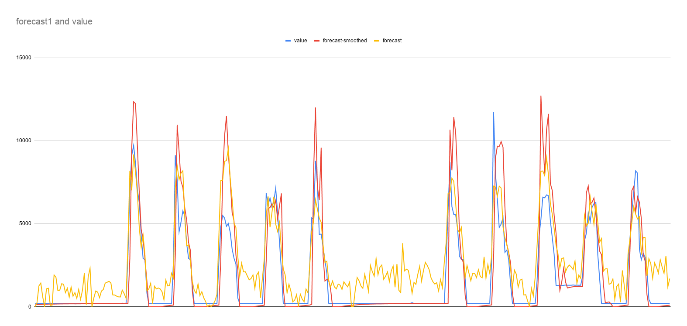
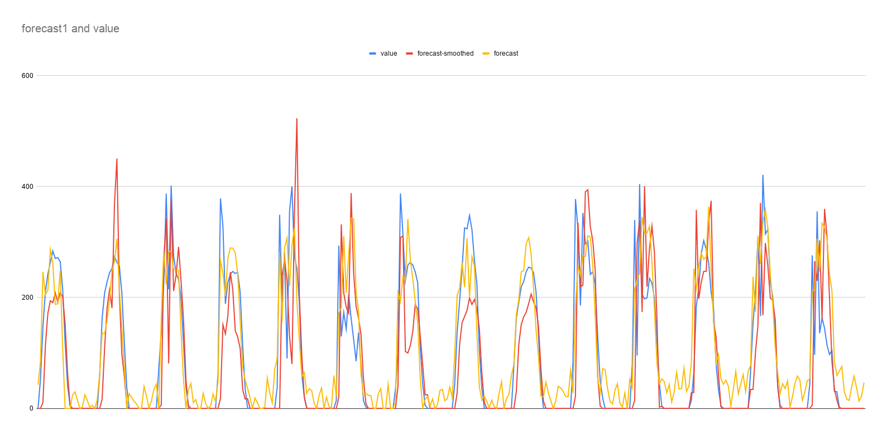
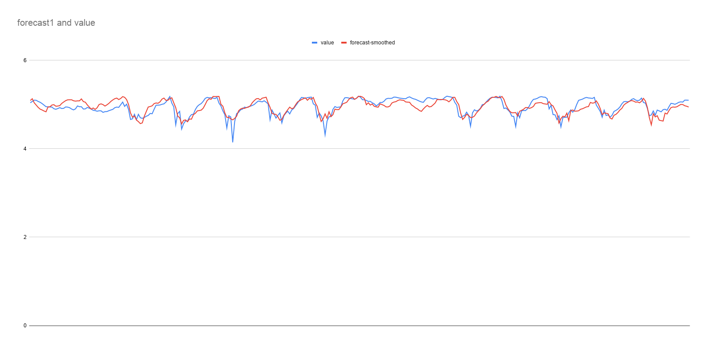

# ts-forecast

Testing data forecasting on different levels for granularity.
Forecasting is done using ARIMA (from `com.workday:timeseries-forecast`) and double exponential smoothing.

Methodology:

1. Training data are retrieved from SparkWorks.
1. Data are used split to a training part and a to-be-forecasted part.
1. Data are forecasted using thge ARIMA model.
1. The forecasted data are combined with the past data and double exponential smoothing is applied to the combined data array.
1. The forecasted data are compared with the to-be-forecasted part to extract the sum-square-error.

Based on the tests the following parameters are considered the best for most cases:

+ ArimaParams for model for data every 5 minutes: (p=?, d=?, q=?, P=?, D=?, Q=?, m=?);
+ ArimaParams for model for data every 1 hour: (p=24, d=0, q=2, P=35, D=0, Q=2, m=7);
+ double exponential smoothing parameters: alpha=1.0, beta=0.1

## usage examples

Legend:

+ value: data to-be-forecasted
+ forecast: result of the arima model
+ forecast-smoothed: result of the double exponential smoothing for the forecast period
+ Data points every 1h
+ Forecast Period 336h (14 days)
Examples:

+ lp-temp-1

+ lp-temp-2

+ school-cur-1

+ school-cur-2

+ school-lum

+ lp-water-pressure 

